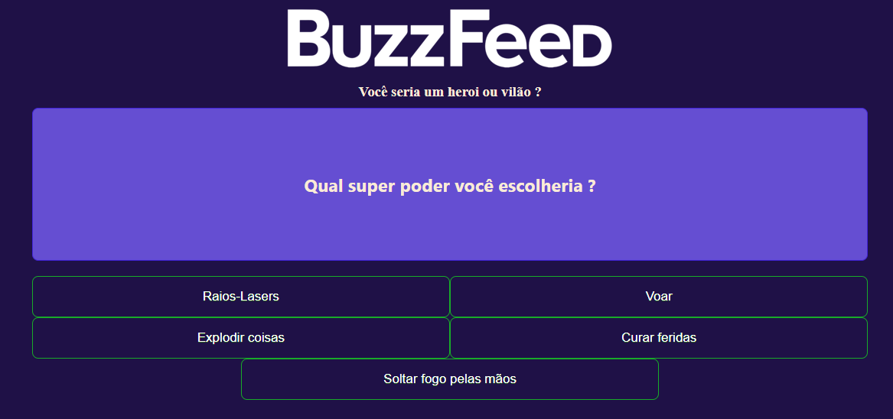

# ProjetoBuzzfeed-clone

(This project was generated with [Angular CLI](https://github.com/angular/angular-cli) version 15.0.3.)
Projeto desenvolvido para o bootcamp Coding The Future Banco PAN - Desenvolvimento Frontend com Angular em parceria com a Dio e mentoria de Felipe Aguiar.

Usando o ng, para criar os componentes "página home" e "quizz".

Vimos na aula como criar o HTML e o CSS do projeto, deixando o projeto com uma cara mais amigável.

Criamos a lógica do jogo no componente "quizz", assim como utilizamos diretivas para renderizar páginas e percorrer arrays.

A parte mais complicada foi a renderização de maior ocorrência.

O projeto, apesar de desafiador, foi divertido de fazer,graças ao acompanhamento do instruotr Felipe Aguiar, amor em pessoa

